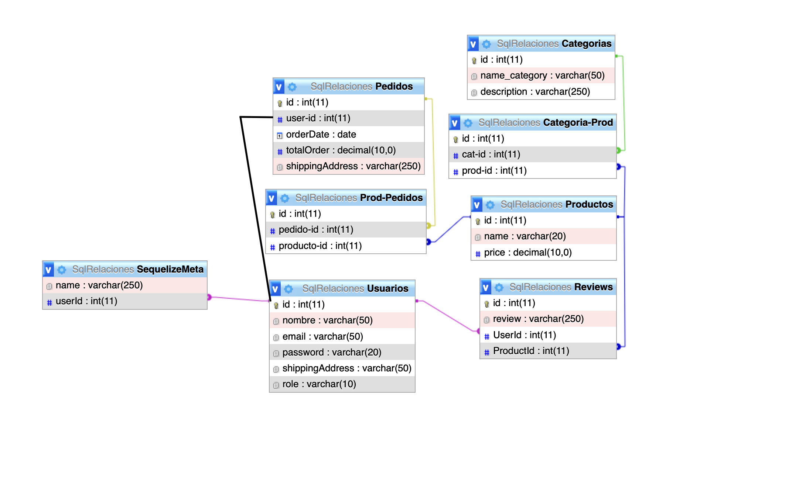

# Proyecto Backend

## Descripción
Este proyecto es un backend para una aplicación de comercio electrónico. Proporciona una API para gestionar usuarios, productos, categorías, pedidos y reseñas.

## Estructura SQL

## Tecnologías Utilizadas
- Express.js
- Sequelize
- MySQL2
- Bcrypt.js
- JSON Web Token (jsonwebtoken)

## Endpoints Disponibles

### Usuarios
- `POST /users`: Crea un nuevo usuario.
- `POST /users/login`: Inicia sesión de usuario.
- `GET /users/info`: Obtiene la información del usuario actual.

### Categorías
- `GET /categories`: Obtiene todas las categorías.
- `POST /categories`: Crea una nueva categoría.
- `GET /categories/:id`: Obtiene una categoría por su ID.
- `PUT /categories/:id`: Actualiza una categoría existente.
- `DELETE /categories/:id`: Elimina una categoría.

### Productos
- `GET /products`: Obtiene todos los productos.
- `POST /products`: Crea un nuevo producto.
- `GET /products/:id`: Obtiene un producto por su ID.
- `PUT /products/:id`: Actualiza un producto existente.
- `DELETE /products/:id`: Elimina un producto.

### Pedidos
- `GET /orders`: Obtiene todos los pedidos.
- `POST /orders`: Crea un nuevo pedido.

### Reseñas
- `GET /reviews`: Obtiene todas las reseñas.
- `POST /reviews`: Crea una nueva reseña.

## Instalación
1. Clona este repositorio.
2. Instala las dependencias utilizando `npm install`.
3. Configura las variables de entorno necesarias.
4. Ejecuta el servidor con `npm start`.

## Contribución
Las contribuciones son bienvenidas. Si quieres contribuir al proyecto, sigue estos pasos:
1. Haz un fork del repositorio.
2. Crea una rama para tu nueva característica (`git checkout -b feature/nueva-caracteristica`).
3. Realiza tus cambios y haz commit (`git commit -am 'Agrega nueva característica'`).
4. Sube tus cambios a tu repositorio fork (`git push origin feature/nueva-caracteristica`).
5. Abre un pull request en GitHub.

## Licencia
Este proyecto está bajo la Licencia MIT.
