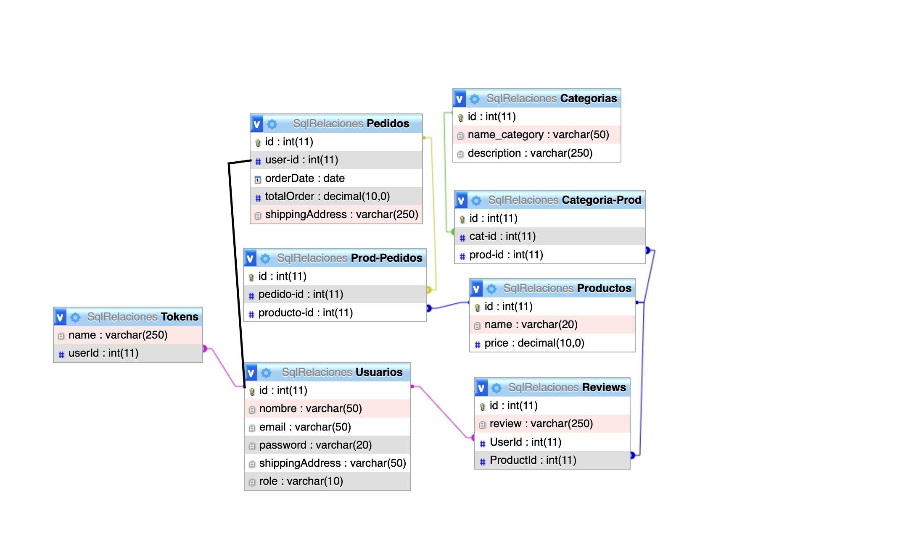

# Backend Project

## Description
This project is a backend for an e-commerce application. It provides an API to manage users, products, categories, orders, and reviews.

## SQL Structure

## Technologies Used
- Express.js
- Sequelize
- MySQL2
- Bcrypt.js
- JSON Web Token (jsonwebtoken)

## Available Endpoints

### Users
- `POST /users`: Creates a new user.
- `POST /users/login`: Logs in a user.
- `GET /users/info`: Gets current user information.

### Categories
- `GET /categories`: Gets all categories.
- `POST /categories`: Creates a new category.
- `GET /categories/:id`: Gets a category by its ID.
- `PUT /categories/:id`: Updates an existing category.
- `DELETE /categories/:id`: Deletes a category.

### Products
- `GET /products`: Gets all products.
- `POST /products`: Creates a new product.
- `GET /products/:id`: Gets a product by its ID.
- `PUT /products/:id`: Updates an existing product.
- `DELETE /products/:id`: Deletes a product.

### Orders
- `GET /orders`: Gets all orders.
- `POST /orders`: Creates a new order.

### Reviews
- `GET /reviews`: Gets all reviews.
- `POST /reviews`: Creates a new review.
- `PUT /reviews/:id`: Updates an existing review.
- `DELETE /reviews/:id`: Deletes a review.

## Installation
1. Clone this repository.
2. Install dependencies using `npm install`.
3. Set up necessary environment variables.
4. Run the server with `npm start`.

## Contribution
Contributions are welcome. If you want to contribute to the project, follow these steps:
1. Fork the repository.
2. Create a branch for your new feature (`git checkout -b feature/new-feature`).
3. Make your changes and commit (`git commit -am 'Add new feature'`).
4. Push your changes to your forked repository (`git push origin feature/new-feature`).
5. Open a pull request on GitHub.

## License
This project is under the MIT License.

